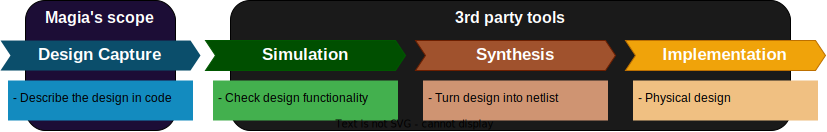

# Magia

> Asta e magia ea a căntat.

## What is Magia?

Magia generates Synthesizable SystemVerilog in pythonic syntax.

The goal of Magia is

- To provide a simple and intuitive way to generate HDL code.
- Take advantage of the Python to produce reconfigurable, reusable HDL code.

## What is not Magia?

- Magia **IS NOT** a High Level Synthesis (HLS) framework, which compile arbitrary Python code into HDL.
- Magia **DOES NOT** support simulation.
    - Major reason is we have reliable and mature simulation tools like
        - [cocotb](https://www.cocotb.org/)
        - [verilator](https://www.veripool.org/verilator/)
    - We want to focus on the Design Capturing / HDL generation part, instead of rebuilding the whole workflow.



## Project Roadmap

Please refer to the [Magia Roadmap](docs/roadmap.md).

## Installation

```bash
pip install syn-magia
```

## Examples

Magia generates Synthesizable SystemVerilog code with the following command:

Refer the [Syntax Documentation](docs/syntax.md) for more details.

```python
from magia import Elaborator, Module, Input, Output


# Define a module
class TopLevel(Module):
    def __init__(self, width, **kwargs):
        super().__init__(**kwargs)
        # Define IO ports
        self.io += [
            Input("clk", 1),
            Input("a", width),
            Input("b", width),
            Output("dout", width),
        ]

        # Implement the logic
        clk = self.io.clk
        self.io.dout <<= (self.io.a + self.io.b).reg(clk)


# Specialize the module
top = TopLevel(width=16, name="TopModule")

# Elaborate SystemVerilog code
result = Elaborator.to_string(top)

# Obtain SystemVerilog code of the top module
sv_code_of_top = Elaborator.to_dict(top)["TopModule"]

# Write SystemVerilog code to a directory
Elaborator.to_files("/tmp/output_dir", top)
```

### Simulation with cocotb

Although Magia does not support simulation, we can use [cocotb](https://www.cocotb.org/) to simulate the generated code.

Make sure you have installed cocotb and simulator required (e.g. [verilator](https://www.veripool.org/verilator/)).

```python
import cocotb
from cocotb.runner import get_runner
from magia import Elaborator, Module
from pathlib import Path

TOP_LEVEL_NAME = "TopLevel"
OUTPUT_FILE = "TopLevel.sv"


# Define a module
class TopLevel(Module):
    ...


# Define your test
@cocotb.test()
async def test_smoke(dut):
    ...


if __name__ == "__main__":
    # Elaborate SystemVerilog code to a file
    Elaborator.to_file(OUTPUT_FILE, TopLevel(width=16, name=TOP_LEVEL_NAME))

    runner = get_runner("verilator")
    runner.build(
        verilog_sources=[OUTPUT_FILE],
        hdl_toplevel=TOP_LEVEL_NAME,
        always=True,
    )
    runner.test(
        hdl_toplevel=TOP_LEVEL_NAME,
        testcase="test_smoke",

        # Let cocotb locates this file
        test_dir=Path(__file__).parent.absolute(),
        test_module=Path(__file__).stem,
    )
```

## Documentation

- [Syntax Documentation](docs/syntax.md)
- [Elaborate Designs](docs/elaborate.md)
- [Memory Syntax](docs/memory.md)
- [External Module](docs/external_module.md)

## Contributing

The project is still a personal project, in a very early stage.
Feel free to open an issue for any bug / feature wishlist.

We also have a [Contribution Guideline](docs/CONTRIBUTING.md) and [Code of Conduct](docs/CODE_OF_CONDUCT.md).
Please take a look before you contribute.

In case you are interested in this project, contact me via:
https://github.com/khwong-c

## Reference

There are many attempts to generate HDL code in Python.
Similar projects are listed below:

- [Amaranth/nMigen](https://github.com/amaranth-lang/amaranth)
- [PyRTL](https://pyrtl.readthedocs.io/)
- [MyHDL](http://www.myhdl.org/)
- [Pyverilog](https://github.com/PyHDI/Pyverilog)