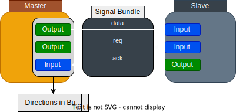
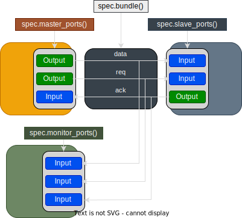

# Signal Bundles

A Signal Bundle is a group of signals carrying correlated information.
Designers can use them to implement protocols.

It is similar to the concept of `interface`, `modport` in SystemVerilog and `Bundle` in Chisel.

The major usage of Signal Bundle includes:

- Implementing common connection and protocol patterns
    - e.g. Valid signal on a data path
    - e.g. Valid-Ready Handshaking
- Forming buses and interfaces that connect Modules and Instances.
    - e.g. AXI, Wishbone, etc

Signal Bundles are implemented with two classes:

- `BundleSpec`: Specification of a Bundle.
- `Bundle`: The Bundle itself which carries `Signal`s with naming.

## Bundle Specification

`BundleSpec` is the class for developers to define the signal configs:

- Name
- Direction
- Width
- Signedness

These configs are copied to the actual Bundles and IO Ports when developers create them.

### Signal Directions

Direction is the most important part when defining a Bundle.
It tells how the Signals are connected to different instances.

A Bundle can be connected to a Master or a Slave.
Master is usually the side that initiates a transaction and the Slave is the responsive side.
Signals usually come with complementary directions on different sides of Master and Slave.
So that, the Signals are connected from Master to Slave, and vice versa.



The direction of a Signal in the `BundleSpec` is defined from the Master's perspective.

- i.e. `Input` in the `BundleSpec` is an `Input` on the Master Port and an `Output` on the Slave Port

---

We can add signals with directions to the `BundleSpec` by adding `Input/Output` to it,
similar to adding IO Ports to a `Module`.

The following example demonstrates a BundleSpec with

- 2 Outputs and 1 Input on Master
- 1 Output and 2 Inputs on Slave

```python
from magia import BundleSpec, Input, Output

simple_bus_spec = BundleSpec()
simple_bus_spec += [
    Output(name="data", width=16),
    Output(name="request", width=1),
    Input(name="acknowledge", width=1),
]
```

### Common Signals

Some bundles may carry signals that have same directions on both Master and Slave.

- e.g. Clock and Resets signals can are Inputs on both sides.

In that case, we can add Common Signals with the `BundleSpec.add_common()` API.

```python
from magia import BundleSpec, Input

simple_bus_spec = BundleSpec()
simple_bus_spec.add_common(Input(name="reset", width=1))
```

We will have an Input port `reset` on both Master and Slave.

## Bundles and IO Ports Creation

We can create the actual `Bundle` and `IOPorts` with factory methods from `BundleSpec`,
after defining the Bundle Specification.

`Bundle` are created to connect Instances and `IOPorts` are created to append on Modules I/O (`Module.io`).



| Factory Method               | Description                                                                        |
|------------------------------|------------------------------------------------------------------------------------|
| `BundleSpec.bundle()`        | Create a `Bundle` with a set of `Signal`, without any direction.                   |
| `BundleSpec.master_ports()`  | Create `IOPorts` on Master side, with I/O directions defined in the `BundleSpec`.  |
| `BundleSpec.slave_ports()`   | Create `IOPorts` on Slave side with directions flipped, except the Common Signals. |
| `BundleSpec.mointor_ports()` | Create `IOPorts` with all ports as `Input`.                                        |

### Ports Naming

It is common to have multiple Bundles in the I/O of the same Module.
We can use `prefix` and `suffix` arguments to modify the naming of the ports.

```python
from magia import BundleSpec, Output, Module

data_path_spec = BundleSpec()
data_path_spec += [
    Output(name="data", width=16),
    Output(name="valid", width=1),
]


class Broker(Module):
    def __init__(self):
        self.io += data_path_spec.slave_ports(prefix="input_")
        for i in range(4):
            self.io += data_path_spec.master_ports(prefix=f"output_{i}_")
        ...

```

SystemVerilog generated:

```verilog
module broker (
input  logic  [15:0] input_data,
input  logic   input_valid,
output logic  [15:0] output_0_data,
output logic   output_0_valid,
output logic  [15:0] output_1_data,
output logic   output_1_valid,
output logic  [15:0] output_2_data,
output logic   output_2_valid,
output logic  [15:0] output_3_data,
output logic   output_3_valid
);
...
endmodule
```

## Connections to Instance and Module I/O

