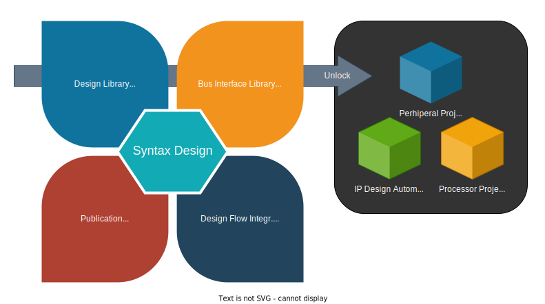

# Magia Roadmap

This document describes how Magia will be developed and where the major focuses are.

## Foundation: Syntax Design

Bridging the HDL Design Capturing from SystemVerilog(SV) to Python is the first step of the project.

We are simplifying clumsy SV syntax to Python expressions, so hardware designers can capture the design in a simpler
way.
This also enable the hardware designer to gain benefits from Python eco-system, not in a hacky / manual manner.

### Design Principals

The main design principals are:

- Following the Python conventions.
- 80/20. Design a set of language that can cover a major faction of use-cases.
- Using hooks and customizable components to fill in the last mile.
    - e.g. the `post_elaborate()` hook and `Blackbox` module.
    - We will assume designers who make use of these customizable blocks have basic understanding on SV.

### Syntax Scope

All syntax being covered must be synthesizable, at least on common FPGA platform.

- Combination Logic
    - Operation Syntax
        - Integer Operations (exclude division)
        - Comparison
        - Logical and Bitwise Operations
    - Conditions
        - `when`: If-Else
        - `case`: Case Switching
            - With `unique` detection
            - Exclude `casex/z` wildcard
    - Constant expression from Pyton to SV
    - Signal Wiring
        - Bits Selection
        - Concatenation
        - Repetition
        - Width casting `signal.with_width(new_width)`
    - I/O
      - Input
      - Output
      - Bidirectional (inout) 
        - This is considered as a corner feature ATM, lower priority

- Sequential Logic
    - Registers
    - Memory
        - Capability to instantiate BRAM and Async LUTRAM on FPGA

- Signal Bundling
    - `IOPorts` defines the IO ports of a Module (`self.io`)
        - Similar to `interface` in SV
        - Create signal bundles by `self.io.signal_bundle()` for bus connections
    - `SignalBundle` defines a set of signals
        - Connecting signal bundles to an instance with `<<=` operator
        - Use `SignalBundleView` to rename signals in a bundle for connection

- Syntax Structure
    - Signal Connection `<<=`
    - Signal Width Propagation
        - Capability to propagate signal width from the drivers / load
        - Raise error if the width of a signal cannot be determined during elaboration
    - Module Specialization and Instantiation
        - `Module` class represents a family of module
        - `Module()` (instance of `Module`) represents a specific implementation (**specialized**) of the module
        - `Module().instance()` instantiates a module
        - Excluding `parameter`, `localparam` and `generate` blocks in SV
    - Blackbox
        - Capability to insert arbitrary HDL code as module body
        - Capability to instantiate blackbox modules
    - External Module Instantiation
        - Create a Module by reading an existing SV file / source in string
        - Infer the IO ports from the SV source
            - No need to specify the IO ports in Python
            - IO ports can be accessed by `self.io`
        - Instantiate the module with `external_module.instance()` as usual

- Elaboration mechanism
  - SV Code Generation
    - `to_string()`: Generate all SV code as string
    - `to_dict()`: Generate SV codes, keyed by submodule name
    - `to_file()`: Generate SV code to file
    - `to_files()`: Generate SV code to a directory
  - Post Elaboration Hook `Module.post_elaborate()`
    - Allows designers to inject extra code into the module
    - Typical Usecase: adding Assertions(SVA)
    
## Next Step: Design Support
- Design Library: Common design components
  - e.g. Queue / Stack
  - e.g. FSM
  - e.g. Fixed Point Logic

- Bus Interface Library
  - AXI-4 (Full, Lite, Stream)
  - Wishbone
- Design Flow Integration (Lower Priority) 

- Publication 
: A new design framework is not useful if there is not well documented and not being understood.

  - Documentation
  - Tutorial
  - Website

## Future Unlocked
Magia should be mature when we reach this point, and ready to accelerate designs.

- IP Design Automations
  - e.g. Regfile + AXI4-Lite interface generation
  - e.g. Pipelined AXI4-Stream IP generation
- Peripherals Design Kit
  - e.g. UART, SPI, I2C, etc.
  - e.g. DMA over interfaces
- Processor Design Project
  - e.g. RISC-V, etc.
  - e.g. Vector/Tensor Processor